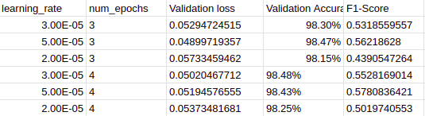

# BERT-Keyword-Extractor
Use BERT Token Classification Model to extract keywords from a sentence.

Parameters tuned as specified in BERT by Jacob Devlin, Ming-Wei Chang, Kenton Lee, Kristina Toutanova.

